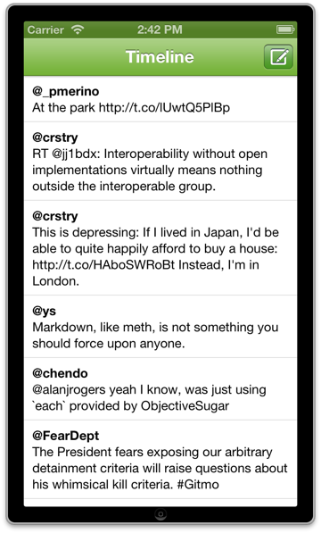

# Twee

A simple Twitter client built with RubyMotion. It basically just shows
the timeline and allows to post.

Icons attributions:

<a href="http://thenounproject.com/noun/at/#icon-No9629" target="_blank">At</a> designed by <a href="http://thenounproject.com/jens" target="_blank">Jens Tärning</a> from The Noun Project.

<a href="http://thenounproject.com/noun/chat/#icon-No15023" target="_blank">Chat</a> designed by <a href="http://thenounproject.com/martincf" target="_blank">Martin Chapman Fromm</a> from The Noun Project.
